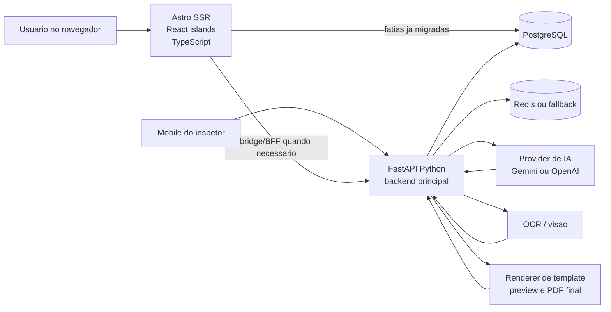
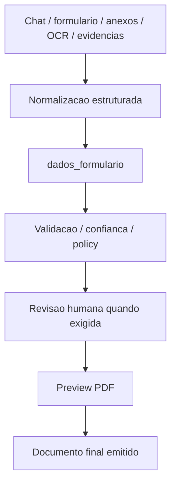

# Mapa de Arquitetura: Front, Back, IA e PDF

Objetivo deste arquivo:

- mostrar, de forma curta, onde cada responsabilidade deve morar;
- evitar confusao entre "frontend novo" e "backend principal";
- fixar o fluxo correto de `IA -> dados_formulario -> preview/final PDF`.

## 1. Leitura rapida

Hoje, a arquitetura mais segura para o Tariel V2 e:

- `Astro + React + TypeScript` para o frontend novo e os portais em migracao;
- `Python + FastAPI` para o backend principal e para o nucleo pesado de produto;
- `Prisma + PostgreSQL` para leitura/escrita server-side das fatias web novas que ja sairam do legado;
- `Python` continua como ownership preferencial para IA, OCR, politica documental e renderizacao de PDF.

Em uma linha:

- `Astro` cuida da experiencia web;
- `Python` cuida da inteligencia operacional e documental.

## 2. Mapa macro

## 3. O que fica no frontend novo

Workspace:

- `web/frontend-astro/`

Responsabilidades corretas:

- shells SSR dos portais novos;
- layout, navegacao, UX e componentes;
- autenticacao e sessao das fatias que ja foram migradas para o V2;
- formularios e mutacoes leves de portal;
- BFF/bridge controlado quando a tela nova ainda depende de backend legado;
- leitura server-side com Prisma quando a fatia ja esta assumida no V2.

Exemplos de ownership natural do Astro:

- `/admin/*`
- `/cliente/*`
- `login` e shells de portais em migracao;
- paginas SSR e handlers pequenos ligados ao portal.

O Astro nao deve virar:

- motor de OCR;
- pipeline central de IA;
- motor de emissao de PDF;
- lugar principal da politica documental;
- backend principal do inspetor/chat/mesa.

## 4. O que fica no backend Python

Workspace:

- `web/`

Leitura arquitetural atual:

- o backend principal do produto segue em FastAPI;
- o monolito modular vive em `web/app/`;
- as integracoes pesadas vivem em `web/nucleo/`.

Responsabilidades corretas:

- APIs centrais de produto;
- dominio do inspetor, chat, mesa e revisor;
- contratos do mobile;
- tenancy, policy, auditabilidade e gates humanos;
- runtime de IA;
- OCR e processamento pesado;
- normalizacao em `dados_formulario`;
- binding de template;
- preview e emissao final de PDF.

Ownership natural do Python:

- `web/app/domains/*`
- `web/app/v2/document/*`
- `web/app/v2/policy/*`
- `web/nucleo/cliente_ia.py`
- `web/nucleo/template_laudos.py`
- `web/nucleo/gerador_laudos.py`

## 5. Regra de fronteira

Se a funcionalidade for principalmente:

- tela
- navegação
- sessao do portal
- UX
- leitura SSR
- mutacao administrativa leve

entao ela tende a morar no `Astro/TypeScript`.

Se a funcionalidade for principalmente:

- regra de negocio densa
- pipeline de documento
- IA
- OCR
- validacao de estrutura
- emissao de PDF
- integracao pesada
- gate humano/politica

entao ela tende a morar no `Python/FastAPI`.

## 6. Fluxo correto de IA e documento

O fluxo correto nao e:

- texto livre da IA -> PDF final

O fluxo correto e:

Leitura correta:

- a IA preenche estrutura;
- o sistema valida e governa;
- o humano aprova quando necessario;
- o renderer materializa o preview e o PDF final.

## 7. Contrato canônico entre IA e documento

O artefato central do fluxo deve ser:

- `dados_formulario`

Nao deve ser:

- texto solto;
- prompt ad hoc amarrado ao template;
- PDF preenchido diretamente pela IA.

O contrato ideal fica assim:

1. entrada bruta: mensagens, anexos, OCR, checklist, contexto
2. saida da IA: `dados_formulario` estruturado
3. camada de governanca: confianca, blockers, policy, mesa/revisor quando necessario
4. renderer documental: preview e documento final

## 8. Onde o Python continua sendo a melhor escolha

Para este projeto, Python continua sendo a melhor escolha para:

- orquestrar provider de IA;
- lidar com OCR e processamento pesado;
- consolidar `dados_formulario`;
- validar regras documentais;
- renderizar preview sobre template base;
- gerar PDF final;
- manter trilha auditavel do fluxo documental.

O motivo nao e "a API de IA so funciona bem em Python".
O motivo e:

- o ownership atual do nucleo documental ja esta em Python;
- o renderer e o pipeline ja existem nesse lado;
- mover isso agora para Node aumentaria custo e ambiguidade sem ganho proporcional.

## 9. O que seria um erro arquitetural agora

Erros a evitar:

- colocar logica principal de IA dentro do frontend Astro;
- fazer o frontend escrever PDF;
- tratar texto livre como contrato documental final;
- acoplar template diretamente a um provider especifico;
- duplicar regra de policy em TypeScript e Python;
- migrar IA/PDF para Node so por simetria de stack.

## 10. Decisao pratica para o projeto

Decisao recomendada hoje:

- manter o frontend novo em `Astro + React + TypeScript`;
- manter o backend principal em `Python + FastAPI`;
- manter `IA + OCR + dados_formulario + preview/final PDF` no backend Python;
- usar o frontend novo como cliente ou BFF do backend Python quando a vertical exigir;
- usar Prisma no Astro apenas onde a fatia nova ja tem ownership claro e seguro.

## 11. Formula curta para lembrar

Use esta frase como atalho:

- `Astro mostra, autentica e orquestra a web nova.`
- `Python entende, governa e materializa o documento.`

## 12. Atalho operacional

Se a duvida for especificamente:

- "essa tarefa vai para Astro ou para Python?"

use tambem:

- `docs/CHECKLIST_ABERTURA_TAREFA_ASTRO_PYTHON.md`
